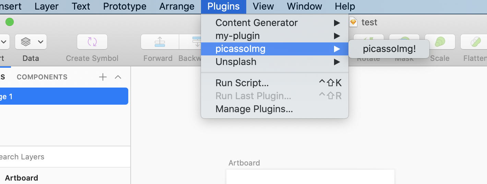
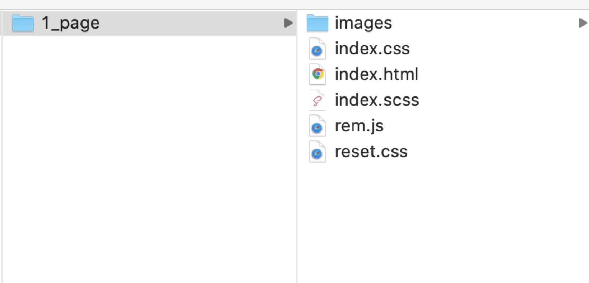
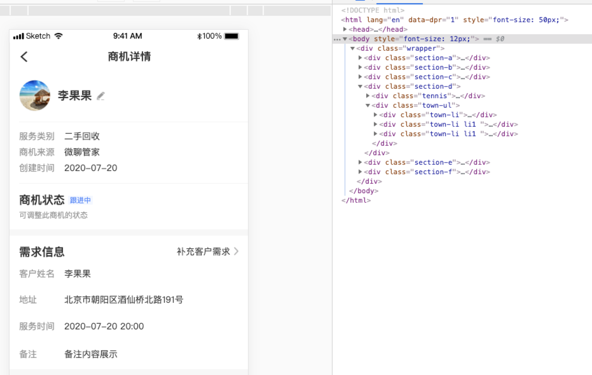

# Picasso

> A tool automatically convert sketch to code.

## 简介

[Picasso](https://picassoui.58.com)是58同城推出的一款sketch设计稿智能解析工具，可将sketch设计稿自动解析成还原精准，可用度高的前端代码。

## 前提

- Mac >= 10.15.1
- Sketch >= 60 [下载Sketch](https://www.sketch.com/)
- Node >= 8.9.3

## 使用方法

- 注意：仅仅支持Mac环境(由于Sketch软件只支持Mac环境，而解析需要依赖Sketch软件)，并且需要安装Sketch软件,[下载Sketch](https://www.sketch.com/)

### 第一步. picassoassets插件安装(辅助解析的sketch插件，必须安装)
注：安装picassoassets插件之前，请先安装[sketch](https://www.sketch.com/)

[下载picassoassets插件](https://picassoui.58.com/index/downloadPicassoassets) => picassoassets.sketchplugin.zip 解压压缩包，双击安装即可，如下：


安装完成后在sketch软件中看到该插件，如下图所示：




### 命令行使用

#### 全局安装

``` sh
  npm install -g @wubafe/picasso
```

#### 使用

``` sh
  # 查看帮助
  picasso --help

  # 查看版本
  picasso --version

  # 解析sketch设计稿
  picasso -s test/index.sketch
  # 或者
  picasso -s test/index.sketch -d test -t 1 -p tt
  
  # 参数介绍
  Options:
  -v, --version               picasso版本
  -s, --src [path]            sketch设计稿源文件路径
  -d, --dest [string]         解析生成的代码存放路径
  -s, --assetsScale [number]     图片尺寸(1:1倍图 1.5:1.5倍图 2:2倍图 3:3倍图) (default: 1)
  -t, --pageType [number]     解析类型: 1-普通版 2-运营版 (default: 1)
  -p, --classPrefix [string]  生成样式className前缀 (default: "")
```

解析过程中,打印日志如下图所示：


解析结果文件（如果不设置dest输出目录，解析结果会放到sketch文件同目录下，结果文件夹名同sketch文件）：



页面效果展示：



### 项目中使用

#### 本地安装
``` sh
  npm install @wubafe/picasso -S
```

#### 使用
``` js
    const picasso = require('@wubafe/picasso');

    // 解析sketch
    (async () => {
        await picasso({
            src: 'test/index.sketch', // sketch源文件路径
            dest: 'test', // 生成代码存放路径
            assetsScale: 1, // 导出图片尺寸(1 1.5 2 3) 默认 1
            pageType: 1, // 1 普通版 2 运营版 默认 1
            classPrefix: '', // 生成样式className前缀 默认 ''
        });
    })()
```

## 启动项目
``` sh
  # 安装依赖
  npm install

  # 运行项目,即可进行解析
  npm run dev
```

## 运行 Sample
- sample/demo.sketch sketch源文件，可用sketch软件打开进行查看
- sample/demo/1_page/* 解析生成代码，用浏览器打开sample/demo/1_page/index.html文件,即可预览生成的页面。

## 贡献
欢迎参与picasso项目的开发建设和讨论。
> 提交 pull request 之前请先提 [Issue 讨论].
